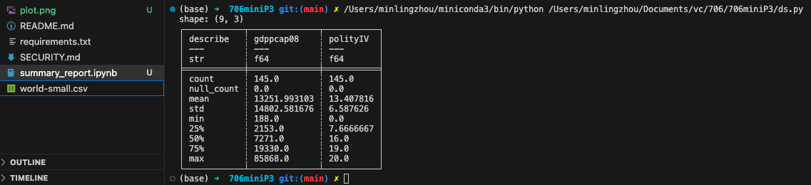

# Pandas Descriptive Statistics Script

## Files

* `world-small.com` -- Dataset to read
* `ds.py`-- Python script using Pandas for descriptive statistics
* `summary_report.ipynb` -- Markdown summary statistics (mean, median, statistics deviation) report
* `plot.png` -- Data visualization generated by python script "ds.py"

## Requirement.txt

Add three dependency (polars, plotly, kaleido) by ds.py script to `requirement.txt`

```
polars==0.19.2
plotly==5.16.1
kaleido==0.2.1
```

## Design

Python script `ds.py` using Polars to read a csv file `world-small.csv`. The script generates summary statistics (mean, median, standard deviation), and creates one data visualization. Summary report is generated as `summary_report.jpynb`

## Status

By running "ds.py" script, the summary statistics (mean, median(50%), statistics deviation) is printed out, and the data visualization is saved as "plot.png".
